<!-- ⚡ COMMAND CENTER BOOT SEQUENCE -->


<!-- 🔵 ARC REACTOR CORE (custom animated SVG hosted in this repo) -->
<p align="center">
  
</p>

<!-- ⌨️ JARVIS BOOT TEXT -->
<p align="center">
  
</p>

<p align="center">
  <a href="https://www.linkedin.com/in/nikhilraj26/"></a>
  <a href="mailto:nikhil.rajak2106@gmail.com"></a>
  <a href="https://github.com/ashnikr"></a>
</p>

---

## 🧠 OPERATOR PROFILE

```yaml
codename:    ASHNIKR
operator:    Nikhil Kumar
division:    AI/ML Engineering — Antino Labs
mission:     Building autonomous agents, RAG systems & vision intelligence
active_ops:  [LLM Orchestration, Agent Mesh, Medical Imaging AI, Workflow Automation]
status:      ⚡ ALL SYSTEMS NOMINAL
```

---

## 🛰️ TECHNOLOGY MODULES

<p align="center">
  
</p>

<p align="center">
  
  
  
</p>
<p align="center">
  
  
  
  
</p>
<p align="center">
  
  
  
  
</p>
<p align="center">
  
  
  
</p>

---

## 📊 LIVE TELEMETRY — SYSTEM DASHBOARDS

<p align="center">
  
  
</p>

<p align="center">
  
</p>

<p align="center">
  
</p>

<p align="center">
  
</p>

---

## 🐍 NEURAL DATASTREAM

<p align="center">
  
</p>

---

## 🚀 MISSION ARCHIVES

<table align="center">
<tr>
<td width="50%" valign="top">

### 🤖 AUTONOMOUS AGENT — <a href="https://github.com/ashnikr/Autonomous-AI-Workflow-Automation-Agent-">OPEN FILE</a>
> **CLASSIFICATION:** Agent Systems
> Autonomous AI agent executing end-to-end workflow automation with LLM reasoning.

`Python` `LLMs` `Agents` `Automation`

</td>
<td width="50%" valign="top">

### 👁️ OCT IMAGING — <a href="https://github.com/ashnikr/OCTImaging">OPEN FILE</a>
> **CLASSIFICATION:** Medical Vision
> Deep learning on OCT retinal scans for diagnostic intelligence.

`Python` `Deep Learning` `Computer Vision`

</td>
</tr>
<tr>
<td width="50%" valign="top">

### 🏥 MEDIVORA — <a href="https://github.com/ashnikr/Medivora_oct">OPEN FILE</a>
> **CLASSIFICATION:** MedTech AI
> AI-powered medical imaging analysis platform.

`Python` `CV` `Healthcare AI`

</td>
<td width="50%" valign="top">

### ⚙️ N8N AUTOMATION GRID — <a href="https://github.com/ashnikr/n8n_project">OPEN FILE</a>
> **CLASSIFICATION:** Workflow Systems
> Intelligent automation pipelines built on n8n.

`Python` `n8n` `Automation`

</td>
</tr>
</table>

---

<p align="center">
  
</p>


